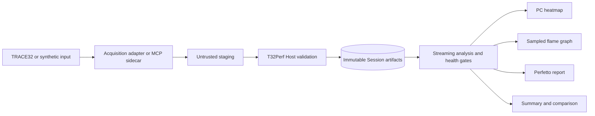

# T32Perf

T32Perf is an evidence-aware performance-observation toolchain for TRACE32-based embedded systems. It turns debugger captures and synthetic fixtures into versioned Session artifacts, health-gated summaries, PC heatmaps, sampled flame graphs, comparisons, and Perfetto/Chrome Trace reports.

> [!IMPORTANT]
> A chart is only as trustworthy as its capture evidence. Synthetic input proves Host behavior, not hardware behavior. A processor name, debugger configuration, symbol label, or successful Remote API connection does not establish target identity, firmware identity, or production readiness.

## What T32Perf provides

- Versioned data contracts and strict JSON validation.
- Immutable, digest-bound Session artifacts with explicit provenance.
- Streaming normalization and analysis for functions, Tasks, ISRs, resources, and health.
- Health-gated summaries and content-addressed comparisons.
- Perfetto/Chrome Trace JSON export.
- Generic address and function PC-sampling heatmaps.
- Flat sampled profiles for aggregate PC histograms.
- Takumi-backed flame graphs for observed stack samples.
- A bounded Host MCP service and isolated TRACE32 sampling sidecars.
- A C99 event SDK, software HIL harnesses, and release verification workflows.

## Architecture



TRACE32 owns target access, trace acquisition, debugger state, symbol lookup, and RTOS awareness. T32Perf owns authorization, validation, provenance, normalization, analysis, rendering, and durable artifact publication. Sidecar output is treated as untrusted until the Host validates its request binding, journal, receipt, digest, and Session state.

See the [system architecture](docs/architecture.md) and [data contracts](docs/contracts.md) for the complete trust and ownership model.

## Visualization semantics

| Output | What it represents | What it does not prove |
| --- | --- | --- |
| Address heatmap | Relative concentration of aggregate PC hits | Coverage, exact execution time, or call count |
| Function heatmap | PC hits attributed through an explicitly classified symbol source | Firmware identity unless independently admitted |
| Flat sampled profile | Ranked sampled addresses or functions | Caller/callee relationships |
| Stack flame graph | Frequency of observed root-to-leaf stack paths | CPU time, complete call flow, or execution coverage |
| Perfetto report | Timestamped canonical observations when the source provides them | Hardware correctness by itself |

Every renderer preserves its evidence class. It does not convert statistical counts into timestamps, infer missing call stacks, or promote debugger-reported labels into verified firmware evidence.

## Quick start

The deterministic software loop requires Rust and Cargo but no TRACE32 hardware:

```text
cargo build --release -p t32perf

t32perf --artifact-root ./artifacts --json capture --provider synthetic --id quickstart-001 --events 1024
t32perf --artifact-root ./artifacts --json analyze quickstart-001
t32perf --artifact-root ./artifacts --json summary quickstart-001 --top 10
t32perf --artifact-root ./artifacts --json convert quickstart-001 --format perfetto-json
t32perf --artifact-root ./artifacts --json validate quickstart-001 --deep
t32perf --artifact-root ./artifacts --json artifacts verify quickstart-001
```

Use `target/release/t32perf.exe` on Windows or `target/release/t32perf` on Unix when the binary is not on `PATH`. The generated timeline is written to `artifacts/quickstart-001/report/trace.json`.

The expected verdict is `VALID` because the synthetic capture receipt declares the observation families provided by the fixture. It is not hardware evidence. The [quickstart](docs/getting-started.md) explains prerequisites, output layout, exit codes, and next steps.

## TRACE32 sampling without optional trace IP

The generic sampling paths are capability-driven. They are useful for Cortex-M-class targets, including Cortex-M0+ systems, when optional program-flow trace components such as MTB, ITM, or ETM are absent or unavailable.

| Path | Acquisition | Result | Intrusion |
| --- | --- | --- | --- |
| PC sampling | Aggregate `PERF.PC.HITS()` buckets | Address/function heatmap and flat sampled profile | RealTime where supported; StopAndGo is explicitly marked intrusive |
| Stack sampling | Bounded `Break -> Frame.Up -> Frame.Down -> Go` snapshots | Folded stacks and a true sampled flame graph | Intrusive on every halt cycle |

PC sampling can label hot regions with TRACE32's loaded symbol table. Those labels identify debugger-reported code locations; they do not by themselves verify the deployed firmware. Function projection from an ELF requires an explicit firmware-binding evidence class.

Stack sampling preserves observed frame paths and therefore supports a hierarchical flame graph. Flame width is sample count, not elapsed CPU time or call count. Each walk is bounded, target resumption is journaled, and unresolved or unverifiable terminal frames remain visible in the evidence.

The sidecars are Remote API clients, not PowerView launchers. A deployment must start `t32marm`/PowerView with an approved configuration and startup script, expose a dedicated loopback Remote API endpoint, and bring the target to the required state before capture. Core architecture alone does not prove optional trace components or physical target identity.

Read the [sampling architecture](docs/sampling-architecture.md), [TRACE32 integration runbook](docs/trace32-runbook.md), and [hardware verification policy](docs/hardware-verification.md) before using a physical target.

## MCP surfaces

The Host service starts with:

```text
t32perf --artifact-root ./artifacts mcp
```

It exposes eight bounded tools: `perf_capabilities`, `perf_capture`, `perf_get_status`, `perf_get_summary`, `perf_list_artifacts`, `perf_convert`, `perf_compare`, and `perf_run`. The Host retains ownership of Session state, trust material, artifacts, and recovery decisions.

The uv-managed sidecar package provides two isolated executables:

```text
lauterbach-sampling-mcp
lauterbach-stack-sampling-mcp
```

Each surface exposes only its capability query and capture operation. Neither accepts arbitrary PRACTICE commands, paths, firmware loading, reset, or flash operations. Installation and endpoint-pinning instructions are in the [sidecar README](tools/lauterbach-sampling-mcp/README.md).

## Repository layout

```text
crates/t32perf-model          Versioned contracts and schema generation
crates/t32perf-session        Session lifecycle and artifact security
crates/t32perf-trace32        TRACE32 input adapters and target qualification
crates/t32perf-analysis       Streaming analysis and statistical projections
crates/t32perf-heatmap        Accessible PC heatmap renderer
crates/t32perf-flamegraph     Takumi-backed sampled profile renderers
crates/t32perf-perfetto       Streaming Perfetto JSON writer
src/                          Host CLI, MCP service, and orchestration
tools/lauterbach-sampling-mcp Isolated TRACE32 sampling sidecars
sdk/c/                        Target-side C99 event SDK
hil/                          Hardware-in-the-loop orchestration and receipts
skill-trace32-perf/           Qualified t32mcp PRACTICE integration skill
skills/t32perf-mcp/           Host MCP usage skill
xtask/                        Schema, SDK, test, benchmark, and package workflows
```

## Development

Inspect the supported workflow before running individual commands:

```text
cargo xtask --help
```

Run the complete software verification suite:

```text
cargo xtask check
```

Build the documentation site:

```text
uvx --from zensical==0.0.57 zensical build --clean --strict
```

Create a release bundle in a fresh output directory:

```text
cargo xtask package --output dist
```

Packaging is fail-closed and does not overwrite an existing bundle. It verifies archive contents, file digests, release provenance, linkage policy, and an extracted-binary smoke test. See the [development guide](docs/development.md) and [user guide](docs/user-guide.md) for platform-specific details.

## Documentation

- [Documentation home](docs/index.md)
- [Quickstart](docs/getting-started.md)
- [System architecture](docs/architecture.md)
- [Sampling architecture](docs/sampling-architecture.md)
- [Data and Session contracts](docs/contracts.md)
- [User guide](docs/user-guide.md)
- [Operations and troubleshooting](docs/operations.md)
- [Security model](docs/security.md)
- [Implementation status](docs/implementation-status.md)
- [TRACE32 integration runbook](docs/trace32-runbook.md)
- [Hardware verification policy](docs/hardware-verification.md)
- [Development and qualification plan](<TRACE32 - T32MCP Performance Observability System Development Plan.md>)

## Project status

The Host pipeline, contracts, synthetic workflow, statistical renderers, isolated sampling sidecars, and verification harnesses are implemented. Production claims remain deployment-specific: a target adapter, TRACE32 build, endpoint, firmware, symbols, health policy, and HIL evidence must be qualified together. Consult [implementation status](docs/implementation-status.md) for the current boundary.
