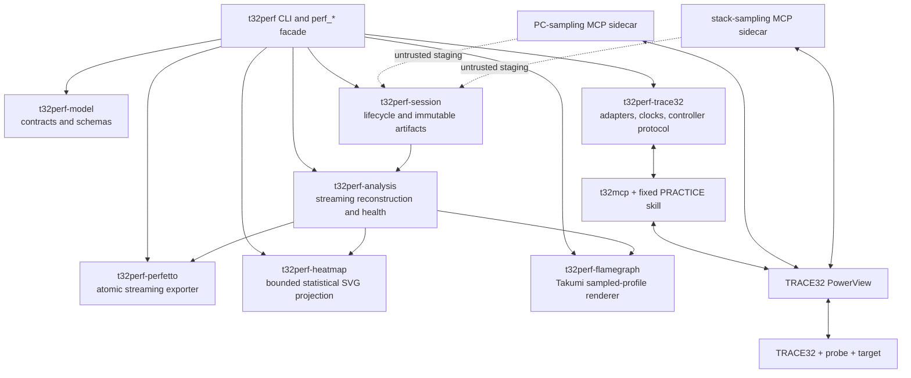
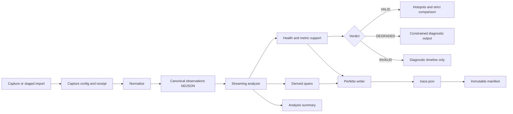
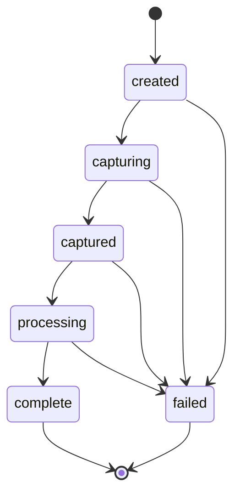
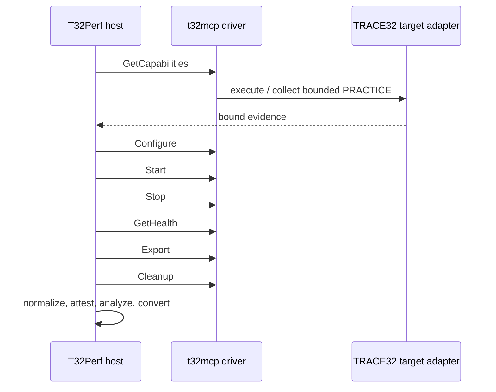

# System architecture

T32Perf is a host-side observation and analysis pipeline. TRACE32 acquires and decodes
target data; T32Perf turns accepted observations into durable Sessions, derived metrics,
comparisons, and Perfetto reports without erasing how each claim was established.

## Responsibility boundary

=== "TRACE32"

    - Acquires hardware trace or statistical samples.
    - Decodes program flow and resolves symbols.
    - Supplies RTOS-aware target information when qualified.
    - Exports an exact, build-specific format through a qualified adapter.

=== "T32Perf"

    - Controls the versioned capture transaction.
    - Validates target-adapter identity and evidence.
    - Stores immutable artifacts and provenance.
    - Normalizes source records into canonical observations.
    - Reconstructs spans, contexts, resources, and health.
    - Gates quantitative output and comparison by evidence quality.
    - Streams a diagnostic timeline to Perfetto JSON.

=== "Deployment"

    - Owns TRACE32, probe, license, target, firmware, ELF, MAP, and RTOS files.
    - Protects the artifact root and signing material with OS access controls.
    - Installs exact t32mcp and target-adapter identities.
    - Produces HIL and qualification receipts for each admitted platform.

!!! note

    T32Perf is not a generic TRACE32 configuration explorer. Unknown targets, builds,
    mappings, or clock relationships are rejected instead of inferred.

## Component model



| Layer | Owns | Does not own |
|---|---|---|
| `t32perf-model` | Closed, versioned data contracts and schema generation | Filesystem state or orchestration |
| `t32perf-session` | Canonical paths, locks, quotas, atomic writes, catalogs, manifests | TRACE32 interpretation |
| `t32perf-trace32` | Source adapters, ordering, clock merge, controller wire protocol, target profiles | Quantitative policy |
| `t32perf-analysis` | Streaming state, derived spans, health, hotspots, comparisons | Capture transport or persistence |
| `t32perf-perfetto` | Bounded-memory trace serialization and atomic publication | Trust decisions |
| `t32perf-heatmap` | Accessible, bounded SVG projection of validated PC-hit heatmaps | Capture, attribution, or trust decisions |
| `t32perf-flamegraph` | Takumi rendering of flat PC profiles and observed stack paths | Capture, symbol trust, or time semantics |
| Root crate | CLI, public façade, and cross-layer trust enforcement | Vendor acquisition internals |

## End-to-end data flow



Normalization is a format and ordering boundary, not a trust upgrade. Hardware trust comes
from the capture configuration, exact adapter identity, signed attestation or controller
receipt, and qualification evidence.

## Session state and artifacts



A Session is the unit of ownership, recovery, and provenance:

```text
<artifact-root>/<session-id>/
├── request.json
├── state.json
├── manifest.json
├── .session.lock
├── artifact-index/
├── ingest-intents/
├── committed-staging-sources/
├── capture/
│   ├── staging/
│   └── raw/
├── normalized/
├── analysis/
├── report/
└── logs/
```

`state.json` is the only mutable Session document. Artifact metadata and controller
transactions are append-only or immutable; the final `manifest.json` freezes the completed
artifact graph. Every artifact records its kind, relative path, media type, byte size,
SHA-256, producer, and input artifact identities.

See [Data and Session contracts](contracts.md) for the normative invariants.

## Health is a structural gate

| Verdict | Permitted interpretation |
|---|---|
| `VALID` | Quantitative output and strict comparison are permitted for explicitly supported metrics. |
| `DEGRADED` | Diagnostic timeline remains useful; quantitative trust is constrained and strict comparison is rejected. |
| `INVALID` | Diagnostic output only; hotspots and trusted quantitative conclusions are withheld. |

Metric support is independent of the overall verdict. A valid capture can still mark a
specific family as statistical, unavailable, or otherwise unsuitable for an exact claim.

## Real capture control plane

The controller advances through one fixed sequence:



Each phase uses an immutable request, a reserved response staging path, exact output
reservations, and operation-specific evidence. The public façade returns one typed
`next_action` at a time. A root-wide OS lease and append-only journal prevent concurrent
side effects and unsafe replay after a crash.

The driver accepts exactly these upstream MCP tools:

```text
execute_practice_skill
collect_practice_skill_response
abort_practice_skill
```

The higher-level `perf_capabilities`, `perf_capture`, and other `perf_*` operations belong to
T32Perf; they are not presented as tools added to upstream t32mcp.

## Host MCP service

The same provenance-bound `t32perf` binary provides a Host-owned MCP service through its
`mcp` stdio mode. A trusted launcher fixes one artifact root and every response and resource
limit. It exposes only `perf_capabilities`, `perf_capture`, `perf_get_status`,
`perf_get_summary`, `perf_list_artifacts`, `perf_convert`, `perf_compare`, and `perf_run`;
it provides no MCP resources or prompts. Results and tool-level errors are structured and
bounded, returning artifact references instead of large artifact bytes. A raw JSON line is
limited to 1 MiB and a typed result envelope to 256 KiB; duplicate structured/text JSON wire
representations must also fit within the 1 MiB frame limit. Each tool uses a dedicated operation
output schema. Capabilities and capture project only the terminal public action, and do not
expose upstream handoffs that the server has already consumed in schemas or runtime payloads.
Schema constraints are validated again at runtime, and JSON-RPC request IDs have a separate
128-byte encoded limit.

The server drives Controller work for `perf_capabilities` and `perf_capture` internally, and
consumes upstream execute/collect/workload handoffs without exposing those low-level actions to
the client. A terminal payload can still request a high-level Host `next_action`, such as
calling `perf_capture`. `perf_run` is the preferred path for a new Session and requires the MCP
caller to provide a portable, stable Session ID in advance. A cancelled call can still complete
an external operation at a durable boundary, so the caller must query `perf_get_status` before
retrying. This façade does not change the independent roles of upstream `t32mcp` or the two
sampling sidecars; see [ADR 0007](adr/0007-host-mcp-service.md).

## Generic PC-sampling sidecar

Targets without qualified trace IP use a separate aggregate path. It neither changes the
official three-tool inventory nor fabricates timestamped observations:

```mermaid
flowchart LR
    PREP[Host sampling prepare] --> CAP[Immutable request + operation capability]
    CAP --> MCP[sampling-only MCP]
    MCP --> PERF[Dedicated loopback TRACE32 PERF endpoint]
    PERF --> STAGING[capture/staging]
    STAGING --> RECEIPT[Host journal/request receipt]
    RECEIPT --> HIST[unverified pc-hit-histogram/v1]
    HIST --> GATE[Aggregate quality gate]
    HIST -. optional immutable ELF assertion .-> BIND[Host bind-firmware evidence]
    BIND --> GATE
    GATE --> MAP[heatmap/v1]
    MAP --> SVG[Bounded accessible SVG]
```



The sidecar accepts only an already-running target and never issues explicit run control,
reset, flash, or workload commands. RealTime is the default method; StopAndGo requires an
explicit intrusive policy and can periodically halt/resume execution internally. Both services
share the root-wide TRACE32 execution lease, while the sidecar additionally validates the Host
operation token and request under the Session lock. Its journal and recovery projection are
independent from the official Controller.

Deployment is two-stage. A capabilities-only instance reads the TRACE32 software and a hashed
probe identity; capture is disabled. The capture-capable instance is restarted with that exact
endpoint fingerprint pinned and rejects any mismatch before journal recovery or `PERF` mutation.
The HIL path additionally rereads and hashes the Host Session state, request, exact artifact
catalog, histogram, heatmap, and SVG instead of trusting wrapper metadata.

`PERF.PC.HITS()` produces aggregate counts without timestamps. The histogram therefore uses
sorted, nonoverlapping half-open address buckets and an explicit in-scope denominator. It does
not enter the canonical `ObservationEvent::Sample` timeline. Verified firmware is required for
trusted function or source-line attribution. The chip-agnostic path can instead produce explicitly
diagnostic function ranking from a precommitted ELF digest; it remains `deployment_asserted`, not
verified, and proves no target-memory equality. Without either binding, only address output is allowed. See
[ADR 0005](adr/0005-generic-pc-sampling.md).

## Intrusive stack-sampling sidecar

The independent intrusive sidecar performs bounded `Break → Frame.Up/Down → Go` snapshots
and publishes stack samples with optional post-Go, debugger-reported function/source labels
to untrusted staging. The Host verifies the one-use attempt marker and journal, derives a
folded profile, and delegates presentation to `t32perf-flamegraph`. It remains separate because
every sample changes target execution state.
See [ADR 0006](adr/0006-intrusive-stack-sampling.md) and the
[chip-independent sampling architecture](sampling-architecture.md).

## Input and merge model

The normalizer supports canonical NDJSON, explicit CSV, C-wire, qualified SNOOPer ASCII,
and qualified TASKEVENTS input. Multi-source normalization merges 2 to 64 sorted streams.
It rejects clock conflicts, dictionary conflicts, source-sequence violations, and same-tick
ties that cannot be ordered under the declared policy.

!!! warning "No implicit repair"

    The pipeline does not silently sort malformed input, guess a column mapping, classify a
    resource by its name, or infer a clock relationship. Those choices belong in versioned
    configuration and evidence.

## One-shot production workflow

`perf_run` composes the admitted production path into a durable orchestration:

```text
Provision → Controller capture → Normalize → Attest → Analyze → Convert → Complete
```

It verifies deployment configuration, firmware, target qualification, HIL receipts,
attestation policy, workload identity, and resource inputs. A failed external side effect is
not replayed merely because its result is unknown; ambiguous states remain explicit and
fail closed.

## Current qualification boundary

The compiled catalog contains a TC234L/core 0 candidate for TRACE32 build `190766` and
SNOOPer PC statistical sampling. It is a software-complete candidate, not a qualified
production adapter. Function/context/ISR/custom-event/resource-counter capabilities remain
unavailable for that profile, and real endpoint, probe, MCU, RTOS, fault, and native
differential evidence is still required.

Consult [Implementation status](implementation-status.md) before interpreting any capability
and [Hardware verification](hardware-verification.md) before admitting a platform.
