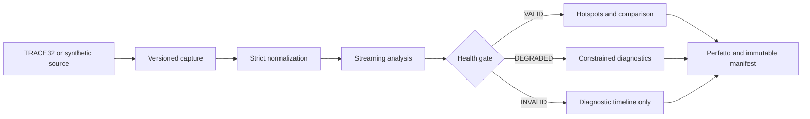
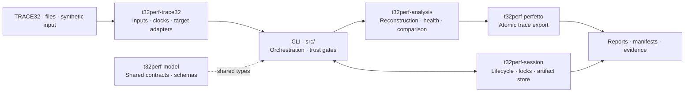
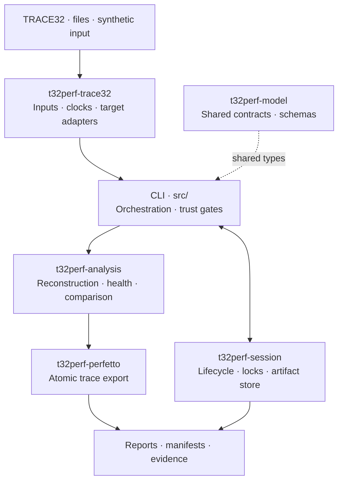

# T32Perf

!!! warning "Evidence boundary"

    A successful synthetic run proves the host software path, not the accuracy of
    a TRACE32 setup, probe, MCU, RTOS, symbol mapping, or hardware metric. T32Perf
    keeps software-only evidence separate from qualified hardware evidence by design.

## From capture to a defensible report

The pipeline never upgrades uncertain input into exact metrics. Observation semantics,
clock relationships, capture provenance, and target-adapter qualification remain explicit
throughout the Session.

## Choose your path

-   :material-rocket-launch-outline:{ .lg .middle } **Evaluate the software path**

    ---

    Build the CLI, run a deterministic synthetic capture, analyze it, open the
    Perfetto report, and verify every artifact.

    [:octicons-arrow-right-24: Quickstart](getting-started.md)

-   :material-console-line:{ .lg .middle } **Operate the CLI**

    ---

    Learn Session lifecycle, normalization, analysis, comparison policies,
    machine-readable output, and semantic exit codes.

    [:octicons-arrow-right-24: User guide](user-guide.md)

-   :material-chip:{ .lg .middle } **Integrate TRACE32**

    ---

    Qualify one exact target, probe, TRACE32 build, firmware, and export mapping
    without turning an unverified candidate into a production claim.

    [:octicons-arrow-right-24: Integration runbook](trace32-runbook.md)

-   :material-shield-check-outline:{ .lg .middle } **Review trust boundaries**

    ---

    Understand path safety, immutable artifacts, strict JSON, attestation,
    controller leases, recovery journals, and deployment responsibilities.

    [:octicons-arrow-right-24: Security model](security.md)

-   :material-code-braces:{ .lg .middle } **Develop and verify**

    ---

    Use the repository-owned `xtask` workflow for Rust, C, Python, schemas,
    HIL software checks, benchmarks, packaging, and documentation.

    [:octicons-arrow-right-24: Developer guide](development.md)

-   :material-file-document-check-outline:{ .lg .middle } **Audit the evidence**

    ---

    Inspect checked-in software benchmark, importer, and control-plane records together with
    the chip-independent sampling architecture and its evidence limitations.

    [:octicons-arrow-right-24: Verification evidence](verification-evidence.md)

## Architecture at a glance

<!-- Keep both diagrams semantically identical; only their responsive direction differs. -->

The [implementation status](implementation-status.md) is the authoritative inventory of
what is implemented, what has only software evidence, and what still requires a laboratory.
