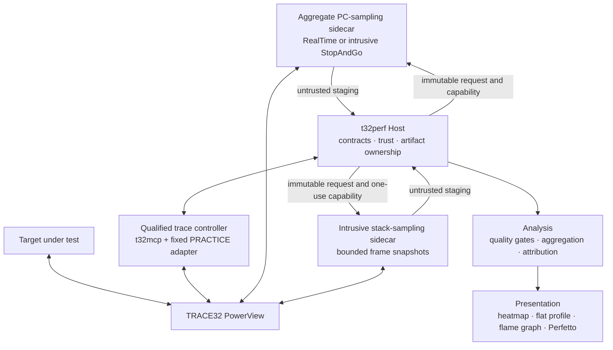
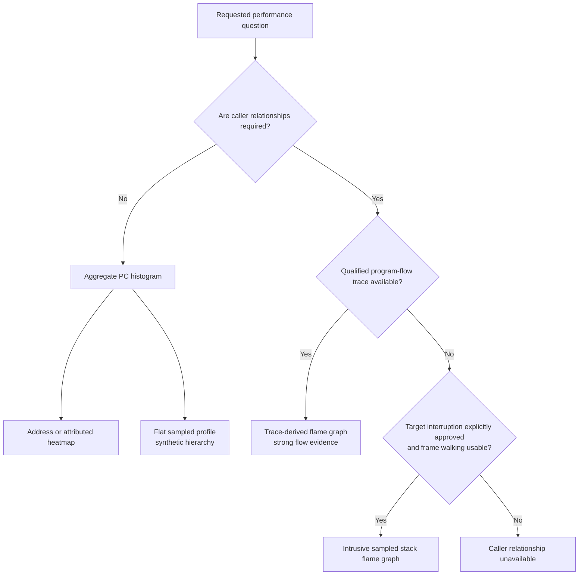
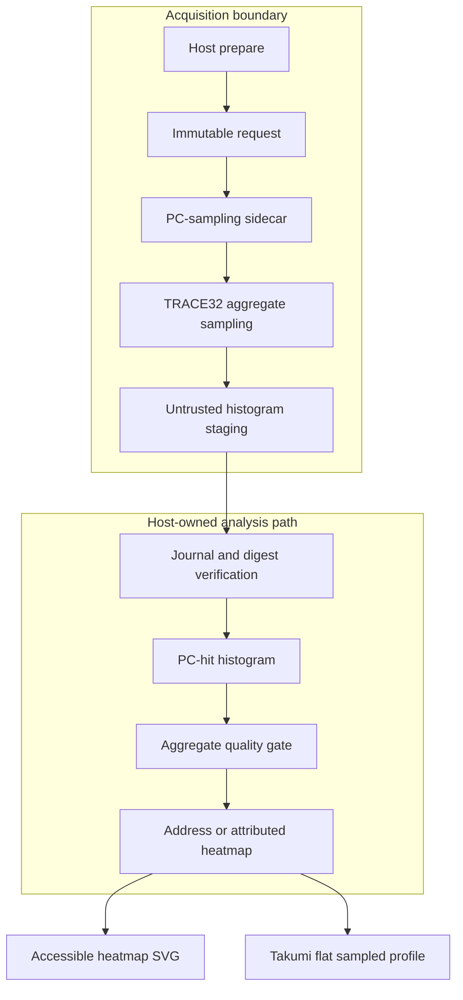
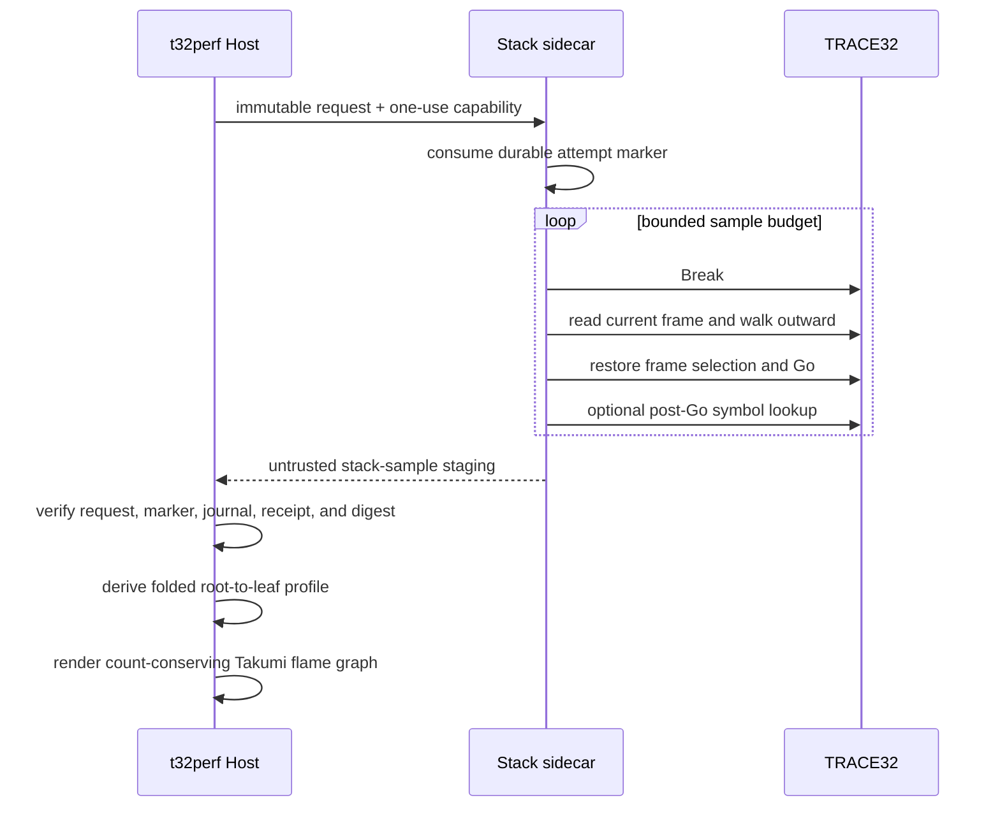
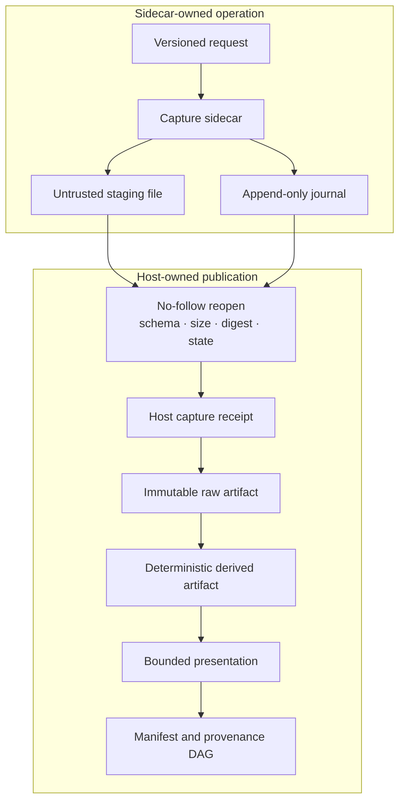

# Sampling architecture

T32Perf keeps acquisition semantics separate from presentation. A heatmap, flat sampled
profile, and stack flame graph may look related, but they are produced from different evidence
and support different claims. No capture mode is inferred from a processor name or assumed
debug component; deployment capabilities must be observed and admitted explicitly.

## Integration topology

The integrations remain separate processes and protocols:

- the qualified controller owns build-specific trace and PRACTICE transactions;
- aggregate PC sampling collects hotspots without fabricating timestamps; confirmed RealTime is
  non-intrusive, while StopAndGo is explicitly intrusive;
- intrusive stack sampling changes target execution state and therefore has a distinct
  acknowledgement, journal, cancellation, and recovery contract;
- the Host owns final artifacts and never treats sidecar staging as trusted output.

All cooperating TRACE32 integrations share an execution lease. Interactive clients that do not
honour that lease must not use the endpoint during an admitted capture.

## Cortex-M0+ class target considerations

For a Cortex-M0+ class target, the processor architecture alone does not establish a trace
capability. Core debug, breakpoint, watchpoint, statistical sampling, optional trace buffers, and
debugger frame unwinding must be queried independently from the live debugger session.

The generic fallback paths are therefore capability-driven:

- a readable program counter and debugger statistical sampler can support a coarse PC heatmap;
- a controllable halt/resume path plus usable frame walking can support intrusive stack samples;
- optional program-flow trace, trace buffers, instrumentation channels, and RTOS awareness require
  their own discovery and qualification;
- a configured processor string is not proof of target identity, loaded firmware, symbol match, or
  optional debug-component presence.

The current stack-sampling contract selects one logical core per capture. Multi-core scheduling,
cross-core ordering, and shared-clock reconstruction require a different versioned contract.

## Choose the evidence before the visualization

| Output | Required evidence | Supported interpretation | Unsupported interpretation |
|---|---|---|---|
| Address heatmap | Aggregate PC-hit histogram and quantitative quality gate | Relative concentration inside requested address ranges | Coverage, exact time, or call count |
| Attributed heatmap | Address heatmap plus an explicit symbol/firmware trust class | Bounded labels with their declared trust | Implicit firmware identity |
| Flat sampled profile | Valid heatmap cells | Compact ranking of observed PC buckets or attributed intervals | Call tree or caller/callee relation |
| Intrusive stack flame graph | Bounded stack snapshots with target-state recovery evidence | Relative frequency of observed stack paths | CPU time, duration, call count, or complete execution flow |
| Trace-derived flame graph | Qualified program-flow trace | Reconstructed flow within the adapter's declared coverage | Evidence outside the qualified trace boundary |

## Aggregate PC-sampling path

The histogram contains sorted, non-overlapping address buckets and an explicit in-scope
denominator. It does not enter the timestamped observation timeline. Symbol-table annotations
and verified-firmware attribution are separate trust classes: a debugger-reported label may be
displayed, but it does not silently establish firmware identity.

The flat sampled profile splits a proven labelled interval from the residual hits in its coarse
bucket. Its parent node is synthetic and exists only to satisfy flame-layout geometry.

## Intrusive stack-sampling path

Every sample is a state-changing operation. The sidecar must prove ownership of the halt, bound
frame-walk and RCL deadlines, restore the selected frame, execute `Go`, and verify the final target
and debugger error states. Cancellation prevents another `Break` and waits for cleanup. Recovery
is a separate one-shot operation and may resume only a journal-proven halt it owns.

An unwind failure is data, not permission to invent a caller. The raw sample records an explicit
outer-boundary classification; the renderer displays that boundary separately from observed
frames. Optional post-resume labels remain debugger-reported and unverified in the version-1
stack contract; there is no stack firmware-binding upgrade path.

## Artifact and trust boundary

The sidecar never writes Session state, the artifact catalog, or the final manifest. The Host
reopens staged bytes, validates their exact request and transaction evidence, then publishes a
new immutable artifact. Derived profiles and renderings reference their immediate input artifact;
the complete provenance closure is recovered from the artifact DAG.

## Verification expectations

A deployment-specific HIL profile remains necessary, but it belongs outside the architecture
description. Admission should verify at least:

1. endpoint, debugger software, probe, processor, core, and firmware identities required by the
   selected trust policy;
2. target state before capture, after every cleanup path, and after cancellation or recovery;
3. exact request, executable, journal, receipt, raw artifact, derived artifact, and rendering
   digests required by that path;
4. quantitative floors, truncation, sampling failures, trace loss, and unavailable metrics;
5. workload repeatability, target-side overhead, native-statistic differential, and declared
   fault scenarios.

Until those deployment-specific records are admitted, the implementation demonstrates an
architecture and software contract, not a capability claim for any particular chip.
